# RootAlert


RootAlert est un mini-agent léger qui surveille en temps réel les logs d’authentification Linux (/var/log/secure sur Rocky/RHEL ou /var/log/auth.log sur Debian/Ubuntu) et envoie une alerte Telegram instantanée dès qu’un événement est détecté :

- 🔓 Connexion SSH réussie
- 🚫 Tentative SSH échouée (bruteforce)
- 🔱 Escalade sudo → root réussie
- ❌ Tentative sudo échouée (mauvais mot de passe)

## 🚀 Fonctionnalités

- Surveillance en temps réel des logs (tail -f)
- Mini détection des événements critiques SSH & sudo
- Détection des Login faild
- Envoi d'alertes Telegram instantané via Bot API
- Service systemd pour un fonctionnement continu
- Code simple, lisible et modulable

## 📦 Installation

### 1. Cloner le projet
```bash
git clone https://github.com/<ton_user>/rootalert.git
cd rootalert
```
### 2. Installer les dépendances
```bash
pip3 install pyyaml requests
```
* Pour l'utiliser en systemd
```bash
pip3 install pyyaml requests
```

### 3. Configurer RootAlert
COpier la configuration exemple
```bash
cp config.example.yaml config.yaml
nno config.yaml
```
####  Exemple :
```bash
telegram:
  bot_token: "TOKEN_TELEGRAM"
  chat_id: "CHAT_ID"

log:
  path: "/var/log/secure"   # RHEL / Rocky
  # path: "/var/log/auth.log"  # Debian / Ubuntu

trusted:
  users:
    - "admsrv"
    #- "otheruser"# 
  ips:
    - "127.0.0.1"
```

 ### ▶️ Lancer l'agent manuellement

 #### 1. Sur la machine :
 ```bash
cd ~/rootalert
```

 ```bash
sudo python3 rootalert.py
```
### Génèrer un événement

1) Une fois le monitoring démarrer, vous pouvez tester les alertes en initiant une nouvelle connexion SSH sur la machines supervisée.

2) Tenter un sudo avec le mauvais mot de passe ou le mauvais utilisateur, vous serez notifier instantanément via Telegram.

### 🔧 Installation en Service systemd (recommandée)

#### 1. Copier l’application dans un dossier propre
 ```bash
sudo mkdir -p /opt/rootalert
sudo cp rootalert.py /opt/rootalert/
sudo cp config.yaml /opt/rootalert/
sudo chmod +x /opt/rootalert/rootalert.py
```
#### 2. Installer le service
 ```bash
sudo cp systemd/rootalert.service /etc/systemd/system/
sudo systemctl daemon-reload
sudo systemctl enable rootalert
sudo systemctl start rootalert
```
#### 3. Vérifier
 ```bash
sudo systemctl status rootalert
```
Pour suivre les logs :
 ```bash
sudo journalctl -u rootalert -f
```

### 🧪 Événements détectés
| Type d’événement | Détection | Exemple                                   |
| ---------------- | --------- | ----------------------------------------- |
| SSH réussi       | Oui       | `Accepted password for user from A.B.C.D` |
| SSH failed       | Oui       | `Failed password for user from A.B.C.D`   |
| sudo → root      | Oui       | `sudo: user : USER=root ; COMMAND=...`    |
| sudo failed      | Oui       | `incorrect password attempts`             |


### 📊 Architecture

```mermaid
flowchart LR

    subgraph Server["🖥️ Serveur Linux (Rocky / Debian)"]
        Logs["📄 /var/log/secure<br/>📄 /var/log/auth.log"]
        Agent["🟢 RootAlert.py<br/>Analyse en temps réel"]
    end

    UserSSH["🔐 Connexion SSH<br/>(Admin ou Attaquant)"] --> Logs
    SudoCmd["🧱 Commandes sudo<br/>(root escalation)"] --> Logs

    Logs --> Agent

    Agent -->|Analyse| Event{"⚠️ Événement<br/>critique ?"}

    Event -->|FAILED| Telegram["📲 Alerte Telegram<br/>immédiate"]
    Event -->|Non whitelist| Telegram
    Event -->|Trusted| Ignore["✔️ Ignoré<br/>(user/IP de confiance)"]

    Telegram --> Phone["📱 Smartphone Admin"]
```
 

